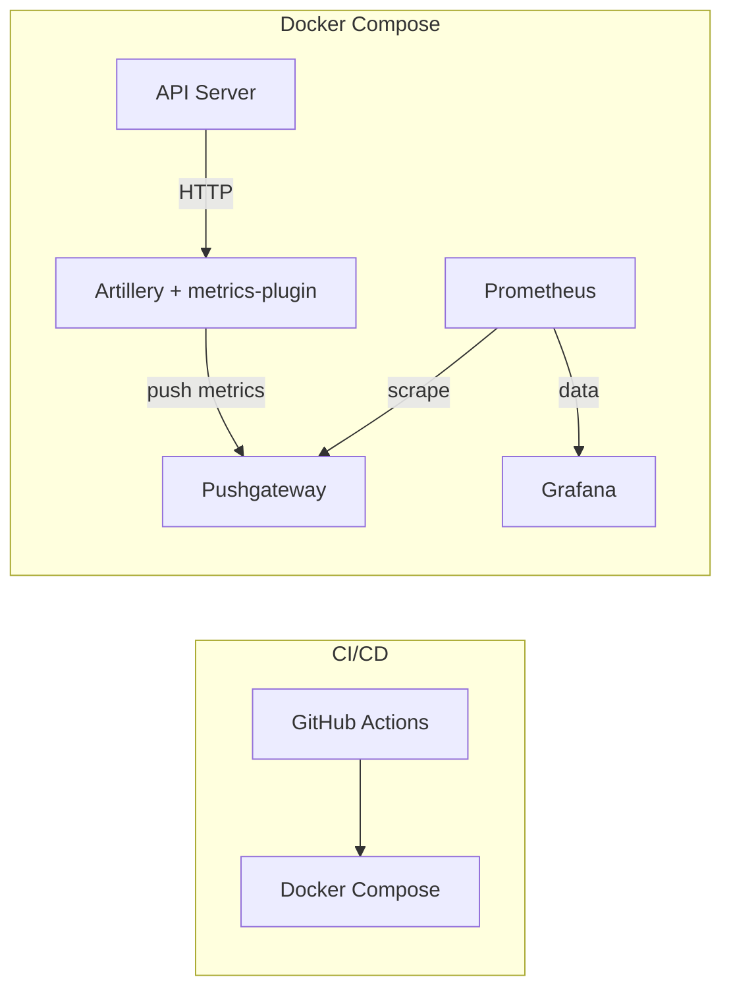

## 🔥 Нагрузочное тестирование и сбор метрик

В проекте настроен **Artillery** + плагин **metrics-by-endpoint** для генерации трафика и экспорта метрик в **Prometheus**, с последующей визуализацией в **Grafana**.

### Основные возможности

- **Рамп-ап → steady-state → рамп-даун** (1→20→0 виртуальных пользователей)
- Отдельный сценарий «Регистрация → Логин → Профиль»
- «Think time» между запросами
- Сбор по-endpoint метрик:  
  • `artillery_vu_count` (активные VU)  
  • `artillery_requests_total` (RPS)  
  • `artillery_errors_total` (ошибки)  
  • `artillery_request_duration_seconds` (латентность p50/p95)

### Шаги запуска

1. **Установить плагин**

   ```bash
   npm install --save-dev artillery-plugin-metrics-by-endpoint

   ```

2. **Поднять Prometheus + Grafana**

```bash
docker-compose -f docker-compose.metrics.yml up -d

docker-compose -f docker-compose.metrics.yml down
```

3. **Запустить API-сервер**

```bash
npm start
```

4. **Запустить нагрузочный тест**

```bash
artillery run load-test.yml
```

5. **Проверить Targets в Prometheus**

http://localhost:9090/targets
– должны быть host.docker.internal:3000 и host.docker.internal:9466 UP

6. **Открыть Grafana**
   http://localhost:3001 (Grafana)
   – Dashboard «Artillery + Prometheus» показывает VU, RPS, Error Rate, Latency
   Готовые дашборды для импорта

## Схема


