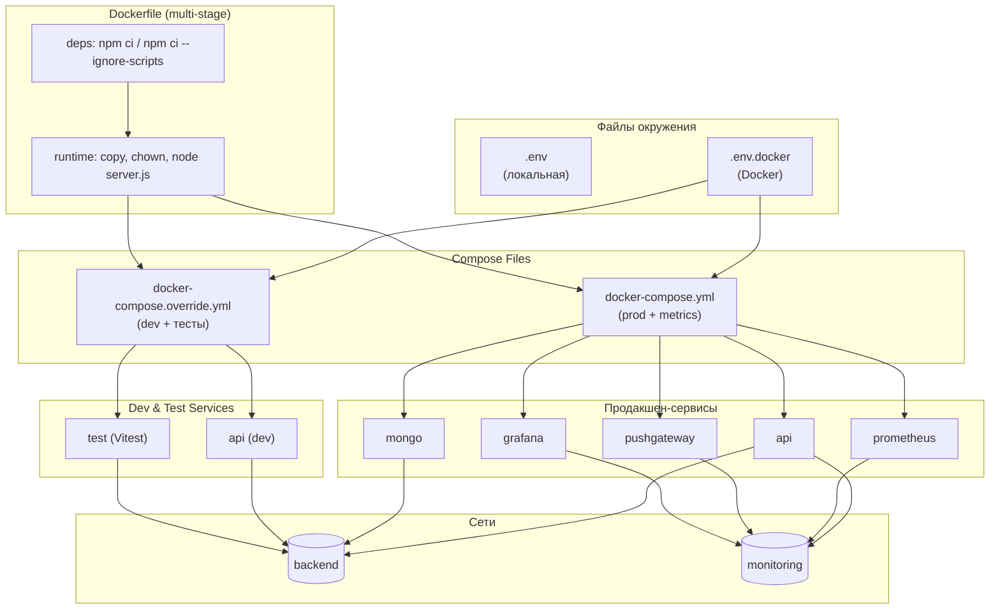

                        ┌──────────────────────────────────────┐
                        │              .env.docker            │
                        │  ┌────────────────────────────────┐  │
                        │  │ PORT=3000                      │  │
                        │  │ JWT_SECRET=…                   │  │
                        │  │ NODE_ENV=development           │  │
                        │  │ MONGO_URI=mongodb://mongo…     │  │
                        │  └────────────────────────────────┘  │
                        └──────────────────────────────────────┘
                                        │
                                        ▼

┌────────────────────────────┐ ┌──────────────────────────┐
│ docker-compose.yml │──────▶│ docker-compose.override.yml
│ (prod, metrics networks) │ │ (dev & test overrides) │
└────────────────────────────┘ └──────────────────────────┘
│ │ │
│ │ │
▼ ▼ ▼
┌──────────┐ ┌──────────┐ ┌──────────┐
│ Service │ │ Service │ │ Service │
│ mongo │ │ prom- │ │ api │
│ (DB, │ │ etheus │ │ (Node.js │
│ health │ │ metrics) │ │ +App) │
└──────────┘ └──────────┘ └──────────┘
│ │ │
│ │ │
▼ ▼ ▼
┌──────────┐ ┌──────────┐ ┌──────────┐
│ push- │ │ grafana │ │ test │
│ gateway │ │ (dash- │ │ (Vitest) │
│ (metrics)│ │ boards) │ └──────────┘
└──────────┘ └──────────┘

# Описание схемы

## Файлы окружения

- **.env** — содержит переменные для локального запуска (например `MONGO_URI=mongodb://localhost:27017/authdemo`).
- **.env.docker** — содержит переменные для Docker (сервис `mongo` вместо `localhost`, общий `PORT`, `JWT_SECRET`, `NODE_ENV`).

## Dockerfile (multi–stage)

### stage deps

- Аргумент `ARG NODE_ENV` задаёт среду (`production` или `development`).
- Устанавливаются зависимости:
  - В **production** — `npm ci --omit=dev --ignore-scripts`.
  - В **development** — `npm ci --ignore-scripts`.

### stage runtime

- Копируются зависимости и код.
- Права на папку `/app` передаются пользователю `node`.
- Образ запускается `node server.js`.

## docker-compose.yml

Определяет продакшен–сервисы:

- **api** — собирается из Dockerfile с `NODE_ENV=production`. Использует `env_file: .env.docker`. Связывается с сетью `backend` и `monitoring`.
- **mongo** — официальный образ MongoDB, том `mongo_data`, `healthcheck`.
- **prometheus**, **pushgateway**, **grafana** — сервисы мониторинга в сети `monitoring`.

Также объявляет том `mongo_data` и сети `backend`, `monitoring`.

## docker-compose.override.yml

Переопределяет **api** для разработки:

- С теми же настройками сборки, но с `NODE_ENV=development`.
- Монтирует код из текущей папки и том `node_modules` для «горячего» обновления.
- Запускает `npm start` (или тесты для сервиса `test`).

Переопределяет **test**, чтобы запускать Vitest (`npm run test:unit && npm run test:api`).

## Сети и взаимодействие

- **backend**: связывает `api` и `mongo`.
- **monitoring**: связывает метрики (`prometheus`, `pushgateway`, `grafana`) и, при необходимости, `api`.
- Docker Compose автоматически настраивает DNS: контейнер `api` видит базу по хосту `mongo`.

## Запуск и проверки

**Продакшен:**

```bash
cp .env.docker .env
docker-compose up --build -d
```

**Разработка + тесты:**

```bash
cp .env.docker .env
docker-compose up --build -d
docker-compose run --rm test
```

**Локально (без контейнеров):**

```bash
cp .env.local .env     # (где .env.local содержит MONGO_URI=localhost)
npm install
node server.js
```

---

Таким образом докеризация:

- Чётко разделяет среды (локальную, dev, prod).
- Использует Dockerfile с кешированием зависимостей и безопасным рантаймом.
- Собирает мониторинговый стек вместе с приложением.
- Обеспечивает «горячую» разработку и CI-тестирование.



> Схема показывает поток: сначала файлы окружения (.env, .env.docker) используются в Docker Compose (`docker-compose.yml` и override), затем Multi-Stage Dockerfile устанавливает зависимости и подготавливает рантайм-образ, после чего Compose заводит продакшен- и dev-сервисы в сетях `backend` и `monitoring`.
